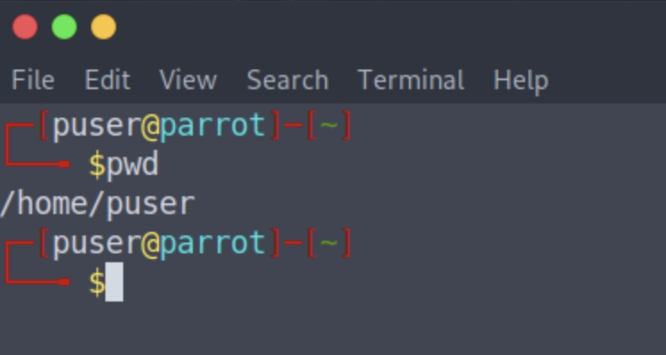
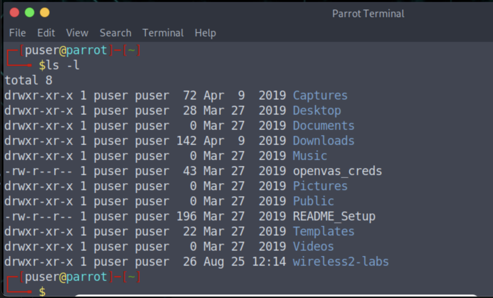
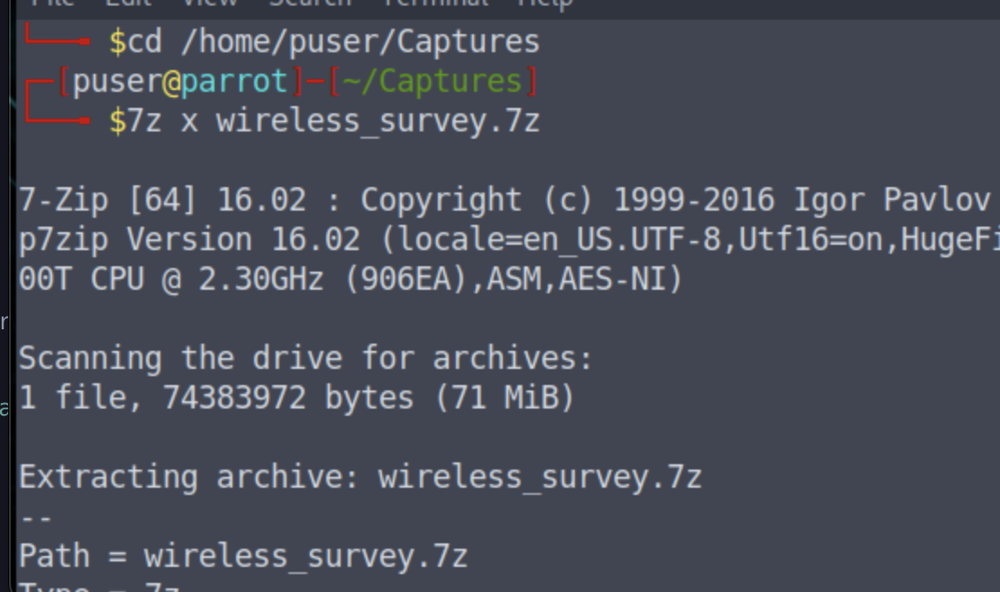
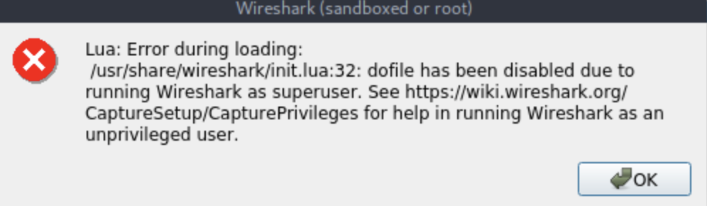
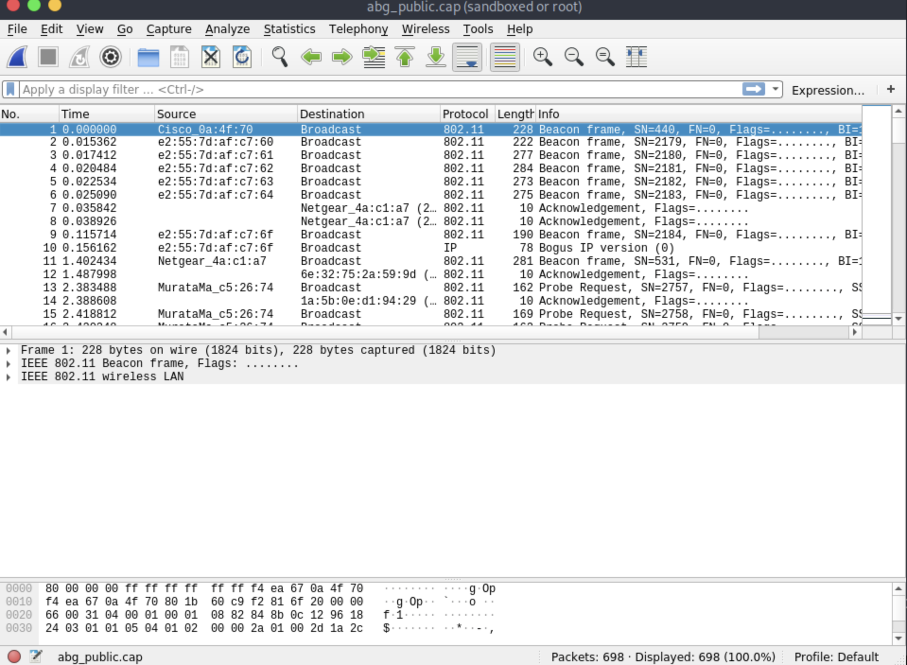

# Lab 0: Getting Acquainted With Linux

About one-third of the Wireless Security objectives focus on vulnerabilities,
threats, and attacks. Attackers and penetration testers will often use ready
built Linux attack platforms to accomplish their goals. As a security focused
professional, you would benefit from knowing some of the tools and commands
common across many Linux distributions. The following are a few of the most
common commands and their usage at the command line. More in-depth information
about each can be found in their respective “man” pages, e.g. `man cat` to learn
more about the options, arguments, usage, and examples for the concatenate
command.


## Step 1: Open a terminal

To open a terminal, press the **Linux Super** key (Windows key). In the dialog
box, type in terminal, then select the appropriate MATE Terminal icon. This
will open an unprivileged user terminal for the user: `puser`. 


You can have several terminals open, however, you should ensure you maintain
your situational awareness as you can have each one inside a different
directory with different privileges. By default, the terminal opened will put
you in your user’s `home` directory (i.e., `/home/puser`).


## Step 2: Run the `pwd` command

First at the command line, run `pwd`. 

```bash
pwd
```

```console
/home/puser
```




This will print the current/working directory (CWD). This is basically where
you are currently in the file system hierarchy. Everything in Linux begins at
top or the root of the file system as indicated by a forward slash (/). Windows
users would understand this as the top of the C drive. Everything else in Linux
is a directory or file underneath this structure. Another important note is
Linux is case sensitive. Unlike Windows, there is a distinction between upper
and lower case.

## Step 3:  Run the `ls -l` command

Next list the contents of the current directory with `ls` . Pass the `-l` (dash
lowercase L) option to show the listing in long format.

```bash
ls -l
```


The output should look like this:

```console
total 8 
drwxr-xr-x 1 puser puser  72 Apr  9   2019 Captures
drwxr-xr-x 1 puser puser  27 Mar 27   2019 Desktop
drwxr-xr-x 1 puser puser   0 Mar 27   2019 Documents
drwxr-xr-x 1 puser puser 142 Apr  9   2019 Downloads
drwxr-xr-x 1 puser puser   0 Mar 27   2019 Music
-rw-r--r-- 1 puser puser  43 Mar 27   2019 openvas-creds
drwxr-xr-x 1 puser puser   0 Mar 27   2019 Pictures
drwxr-xr-x 1 puser puser   0 Mar 27   2019 Public
-rw-r--r-- 1 puser puser 196 Mar 27   2019 README_Setup
drwxr-xr-x 1 puser puser   0 Mar 27   2019 Templates
drwxr-xr-x 1 puser puser   0 Mar 27   2019 Videos
drwxr-xr-x 1 puser puser  26 Mar 27  12:14 wireless2-labs

```


Here's a screenshot:


jj

## Step 4: Change directories iwth the `cd` command

You can change directories from the current directory into any other one in the
filesystem if your user has the privileges to do so. Use the cd command along
with a path to an existing directory in the filesystem hierarchy. Filesystem
paths can be relative to your current directory or can be specified absolutely
beginning with the forward slash irrespective of the current directory
location.


Change the directory to Captures as follows :(Assuming the Captures directory exists at the current location)

```console
cd Captures 
```

(Starting from the top and working down) Creating (making) a new directory can be accomplished with `mkdir` .

```console
cd /home/puser/Captures 
```


## Step 5: Create new directires with `mkdir` command

(Create a new directory named wardrives underneath CWD) 

```console
mkdir wardrives 
```

(Assumes all parent directories exist)

```console
mkdir /home/puser/Captures/wardrives 
```


## Step 6: Copy and move files with `cp` and `mv`

Making copies of and renaming files and directories with the `cp` and `mv` commands
typically requires two arguments to the command in a SOURCE DESTINATION order.
As with the previous examples, the source and destination can be specified
relative or absolute. The move command can be used to rename files when the
destination does not exist in the file system.

Make a copy of `file1` inside the `wardrives` directory:

```console
cp file1 wardrives/ 
```

Using absolute paths: 

```console
cp /home/puser/file1 /home/puser/Captures/wardrives 
```

The `mv` command will remove file1 from CWD and move it into directory wardrives:

```console
mv file1 wardrives/ 
```

We can also rename `file1` to `testdrive1` with the `mv` command


```console
mv file1 testdrive1 
```

If we want to use abolute paths, then: 

```console
mv /home/puser/file1 /home/puser/testdrive1 
```

## Step 7: Deltion using `rm` command

Deleting (removing) files and directories is done the `rm` command. The
permissions set on the file or directory will determine if your user can delete
the object. Directories normally need to be empty to delete them.

Delete file named `ltestdrive1`:

```console
rm testdrive1 
```

Using absolute path:

```console
rm /home/puser/testdrive1 
```

Recurively remove the empty directory `wardrives` from the CWD:

```console
rm -r wardrives/ 
```

You can recurively remove `wardrives` directory regardless of contents

```console
rm -rf wardrives/ 
```

## Step 8: Uing the `man` command to iew Man page

There are a few other commands that you should get acquainted with from the
command line. Use the man pages to get a brief description and their usage.
When man pages are opened in a terminal, help can be obtained by pressing the h
key.

```console
man 7z
```

The output is a such: 

```console
7z(1)                                                          General Commands Manual                                                          7z(1)

NAME
       7z - A file archiver with highest compression ratio

SYNOPSIS
       7z [adeltux] [-] [SWITCH] <ARCHIVE_NAME> <ARGUMENTS>...

DESCRIPTION

       7-Zip is a file archiver with the highest compression ratio. The program
       supports 7z (that implements LZMA compression algorithm), ZIP, CAB, ARJ, GZIP,
       BZIP2, TAR, CPIO, RPM and DEB formats. Compression ratio in the new 7z format
       is 30-50% better than ratio in ZIP format.

       7z uses plugins to handle archives.

FUNCTION LETTERS
       a      Add

       d      Delete

```

Try also doing `man` command as follows on the following commands:

 * 7z 
 * cat 
 * file 
 * find 
 * grep
 * gzip 
 * head 
 * less 
 * lsusb 
 * tail 
 * tar


## Step 8: Extract the Capture to use `wireshark`


You will be using other tools and applications besides the built-in `bash`
terminal command line interface. You will need to be familiar with the protocol
analyzer, Wireshark, that will help you analyze `802.11` radio captures in real
time to identify networks and devices. You can also examine capture files
created with other tools such as `tcpdump` and `tshark`. We will focus most of our
Wireshark time looking at previous captures. The captures used for this course
are zipped up in your Captures directory under the default user’s home
directory. Unzip them.


Use the 7z command to extract the file:

```console
cd /home/puser/Captures 
7z x wireless_survey.7z
```



Switch in to the new directory:

```console
cd wireless_survey
```

See what's therer:

```console
ls -l
```

You should see the following:

```console
Kismet_testrun                        carWifi.kismet.csv
Kismet_testrun_industrial             carWifi.kismet.netxml
LoginHTTPLinksysAYBPass.pcapng        carWifi2.cap
LoginHTTPLinksysDefault.pcapng        carWifi2.csv
LoginHTTPLinksysNewPass.pcapng        carWifi2.kismet.csv
NexAir_WEP.cap                        carWifi2.kismet.netxml
Pentest_setup.pdf                     channel6_public.cap
WEPNet.cap                            hotel-01.cap
WEPNet.csv                            hotel_02.pcapng
WEPNet.kismet.csv                     mod_rockyou.txt.gz
WEPNet.kismet.netxml                  netxml2kml.py.txt
WigleWifi_20171228121232.kml          panera.pcap
abg_public.cap                        probes.cap
airodump_testdrive_2ghz.cap           probes02.csv
airodump_testdrive_2ghz.csv           publix_2.4-01.cap
airodump_testdrive_2ghz.gps           publix_2.4-02.cap
airodump_testdrive_2ghz.kismet.csv    publix_5.0-01.cap
airodump_testdrive_2ghz.kismet.netxml sonic.pcap
att_fedex_open.pcapng                 stripMall_2.4.cap
belkin_4way.cap                       umbctc_2.4.cap
belkin_hidden.cap                     umbctc_5.0.cap
belkin_pin                            wifiscan-export.kml
belkin_pin.c                          wifiscan-kismet-export.csv
bg_public.cap                         wlan0_internet_home.pcap
carWifi.cap                           wlan0mon_dump_home.pcapng
carWifi.csv                           wlan0mon_home_capture.pcap
```


## Step 9: Extract the Capture to use `wireshark`


Use Wireshark to open any of the capture files in the directory just created by
the `7z` tool. 

Run the following as root. Click OK when you see the `lua` error:

```console
sudo wireshark abg_public.cap 
```

You will be prompted to enter the password, which is likely `P@ssw0rd1`

Here is the lua error that you should just click through:




Here is the `wireshark` GUI when it loads:



Going across the top of the Wireshark window are the main menu items beginning
with “File.” Immediately below the main menu items is the “Main Toolbar” with
icons. Below the Main Toolbar is the “Display Filter.” In this filter space you
sort through and selectively display different details of interest inside
capture files. Some example display filters are at the very end of this
exercise handout. The first pane below the display filter area is the “Packet
List” window. Below that is the “Packet Details,” and below that is the “Packet
Bytes” window. Selecting a packet in the packet list pane will change what is
displayed in the panes below. Sections of a packet can be expanded and
collapsed in the packet details pane by clicking on the arrows (>) on the left
of the pane. Any interesting information found in these sections can be
included or excluded in a filter by right-clicking on the information and
selecting “Apply as Filter.” 

For example, if you wanted to sort through all the packets in the entire
capture by receiver address, you would first need to expand the IEEE 802.11
field, right-click on the MAC address, Apply as Filter, Selected. This will
update the display filter near the top. If the filter worked, at the very
bottom of the Wireshark application window you have the “Status Bar” that will
give an updated account of the total packets in the capture and what percentage
(%) of the capture file meet the new display filter criteria you just applied. 


## Important Note 

One Last Thing: Please do not update your Parrot virtual machine when you are
prompted after it reboots.


