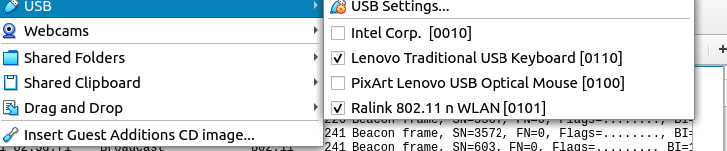

# Section 6 Legacy Security


## Review Questions

[Review Questions](review06-legacy-security.md)

## Lab

For this next go-round, use the capture file `belkin_hidden.cap` to answer some
questions regarding legacy security speed bumps.

You will be using `wireshark` including wireshark filters.

[Wireshark Filters Cheat Sheat](wireshark-filters.md)


## Step 1: Use wireshark on the capture file `belkin_hidden_cap` to answer the following questions?

1. What is the name of the wireless network that is advertised in frame #1?

2. Apply a display filter to only show the wireless frames going to or being
   sent by the client MAC address `44:80:eb:7e:3f:85`. 

3. How many frames are displayed with your filter? What was the syntax of your filter?

4. Using the same display filter from the previous question, what station initiates communications where MAC `44:80:eb:7e:3f:85` is an addressee? 

5. What type of frame and subtype do you see? 

6. What device would have given up the wireless network name causing the original network name in frame #1 to be revealed?

7. Examine the packet details section of one of the probe responses tied to the BSSID from frame #1. Anything catch your attention? Do any research as needed.

8. Characterize the sequence of events and frames between the same access point and the client `(44:80:eb:7e:3f:85)` following the last probe response in frame #613. Apply filters to only focus on the two MAC addresses.

Patience is important part of a good tradecraft. With the right application of
tradecraft, you can go relatively unnoticed in the target space. A client will
likely “de-cloak” a hidden network for us given time. If you get impatient or
the mission requires it, you can de-cloak the network sooner by using a few
tools provided with the Aircrack-ng` suite. 

The next steps will get you familiar with the active process of kicking a
client from its access point temporarily. These steps will help you gain
insight into how the tools work and what wireless network traffic is created.
You will need to create a capture file (-w option) when using airodump-ng so
you can analyze it later to better understand the sequence of events. You will
target a legitimate client and access point. Proceed with caution. Read the
entire sequence before starting.


## Step 2: Attach Wireless Card

Attach a wireless card to the Guest VM operating system.  If you are using the UMBC lab machines, then it should look as follows:



If you are using your own VM, your choice for a wireless card should include those that support the functions of packet injection and monitor mode. You will use both functions. Verify the card is recognized.

```console
iwconfig       # (See that a device wlan0 appears)
```

## Step 3: Set the wireless card into monitor mode. 

(The name of the card might vary.)

```console
airmon-ng start wlan0  # (This creates a new wireless device, wlan0mon)
```

## Step 4:  Listen to the Airwaves

Listen to the airwaves in monitor mode. Select a single client that is already associated to a Target AP (BSSID). Note the MAC address of each. These will be used later with the `aireplay` tool. These next commands are generalized, modify as needed to meet the mission. Do not forget to add the -w option to save the output. Be as specific with the other option as needed.

```console 
airodump-ng wlan0mon                   # By default this will isten on ch 1-14
airodump-ng --band a wlan0mon          # Will listen in 5GHz band
airodump-ng --channel 1,6,11 wlan0mon  # Only channels 1,6,11
airodump-ng --bssid <MACofAP> --channel <Channelof AP> wlan0mon
```

## Step 5: Use `airreplay-ng` to do deauthentication

You need the two MAC addresses from the previous step. `aireplay-ng` supports a
number of attacks including a deauthentication attack (`--deauth`). Both end
stations will receive deauths spoofed from the other side of the current layer
two association. For example, the client station will receive a series of
deauth frames from your wireless card using the spoofed MAC of the access point
and vice versa.

```console
aireplay-ng --deauth 1 -a <MACofAP> -c <MACofClient> wlan0mon
```

A count of one for the deauthentication attack can also be used to push a
client off a wireless network temporarily. The client will then try to rejoin
the same network. During this, the SSID is used in a probe request frame from
the client. This frame would give up the true wireless network name if SSID
cloaking was in use.

You should have a capture file with all wireless frames you generated during
the attack and the communication between the real client and access point. Use
your capture to answer the following questions.

1. How many deauths frames were sent as part of the aireplay-ng attack? How
   many in each direction to the AP and the client? You sent them, you should know.

2. After the last deauth, what do you observe the client doing? Does it
   immediately connect back up the same access point? If it does, what is the
   sequence of events between the access point and client?


