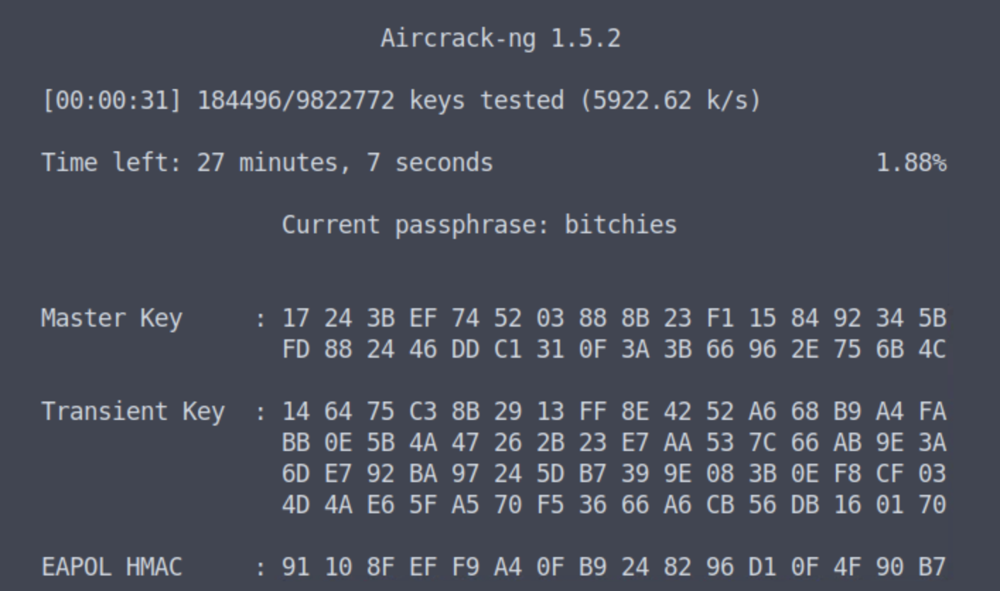

# Lab 9: Preshared Keys

## Review Questions

[Review Questions](./review09-preshared-keys.md)


## Lab

This next exercise is an extension of the previous lab. You will use the
`belkin_4way.cap` file. 

Your target network is tied to a Belkin access point. Your goal is to gain
access to the wireless network. You have a capture file that will assist you in
your operation. 

As noted below, aircrack may not be necessary here, but ertainly we can use the
same approach as in lab 8, e.g. `aircrack-ng`

```console
aircrack-ng belkin_4way.cap -w mod_rockyou.txt
```




If you recover the passphrase, join the network and think about what you might
do once you are a host (client) in the wireless network. You must focus on some
objective defined before you even get here. Research and tradecraft are just as
important as your technique. You may not have to crack the WPA passphrase.


Please answer the following questions:

1. What is the wireless network name and channel?

2. What type of robust secure network is advertised? TKIP, CCMP, WEP?

3. What is the MAC address of the access point? How many clients are associated
   with the access point in the capture file?

4. How many frames are tied to the MAC address of the access point? In other
   words, how many frames include the MAC as some addressee? Apply a display filter.

5. What is the MAC of the client that takes part in the four-way exchange? Is
   it a complete 4- way? How do you know?

6. Was the client in the 4-way ever connected to another wireless network? What
   would you look for in the capture file?

7. How many characters are seen in the Nonces?

8. If you were successful in recovering a passphrase, how did you recover the
   passphrase?

Connect to the Belkin network. This may be a manual process, or you could use
the GUI network manager tool. You will need to make sure your wireless card is
attached to the guest virtual machine and the mode is managed and not monitor.
These next few commands might help to get your wireless card back into managed
mode.

```console
ifconfig wlan0 down
iwconfig wlan0 mode managed
ifconfig wlan0 up
systemctl restart networking
systemctl restart NetworkManager
```

1. If you connected to the wireless network, what is the IP address (inet) and subnet mask (netmask) you received for wlan0? What is the default gateway?

```console
ifconfig wlan0 (Look for inet and netmask in the output)
route -n (Look for the gateway associated with Iface wlan0)
```
